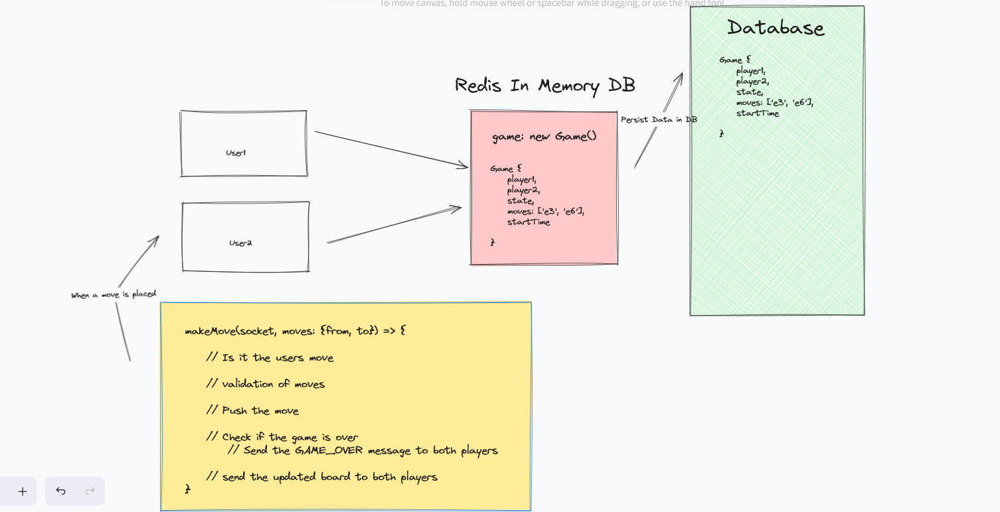

## Advanced Websocket Chess Logic for Frontend



We are maintaining mainly 2 files: Chessboard.tsx & Game.tsx

**Chessboard.tsx**
- We are creating our chessboard with each square and mapping out the squares too
- We are also sending {board move} events to our socket server and then they are displayed on both of the users browsers
- We are also moving the chess pieces and sending events like: 
```Typescript
socket.send(
    JSON.stringify({
        type: MOVE,
        payload: {
        move: {
            from,
            to: squareRepresentation,
            },
        },
        })
    );

        setFrom(null);
        chess.move({
            from,
            to: squareRepresentation,
        });

        setBoard(chess.board());
```


**Game.tsx**
- We are handling the socket message events using the switch case method
- Then we are rendering our Chessboard component and passing our props
  
```Typescript
const Game = () => {
  const socket = useSocket();
  const [chess, setChess] = useState(new Chess());
  const [board, setBoard] = useState(chess.board());
  const [started, setStarted] = useState(false)

  useEffect(() => {
    if (!socket) {
      return;
    }

    socket.onmessage = (event) => {
      const message = JSON.parse(event.data);

      switch (message.type) {
        case INIT_GAME:
          setBoard(chess.board());
          setStarted(true)
          console.log('Game Initialised');
          break;
        case MOVE: {
          const move = message.payload;
          chess.move(move);
          setBoard(chess.board());
          console.log('Move Made');
          break;
        }

        case GAME_OVER:
          console.log('Game OVer');
          break;
      }
    };
  }, [socket]);

  if (!socket) return <div>Connecting ... Might take some time</div>;

  return (
    <div className='justify-center flex'>
      <div className='pt-8 max-w-screen-lg w-full'>
        <div className='grid grid-cols-6 gap-4 w-full'>
          <div className='col-span-4 w-full flex justify-center'>
            <Chessboard
              chess={chess}
              setBoard={setBoard}
              board={board}
              socket={socket}
            />
          </div>
          <div className='col-span-2 bg-zinc-900 w-full flex justify-center'>
            <div className='pt-20'>
              {!started && <Button
                onClick={() =>
                  socket?.send(
                    JSON.stringify({
                      type: INIT_GAME,
                    })
                  )
                }
              >
                Play
              </Button>}
            </div>
          </div>
        </div>
      </div>
    </div>
  );
};

export default Game;

```