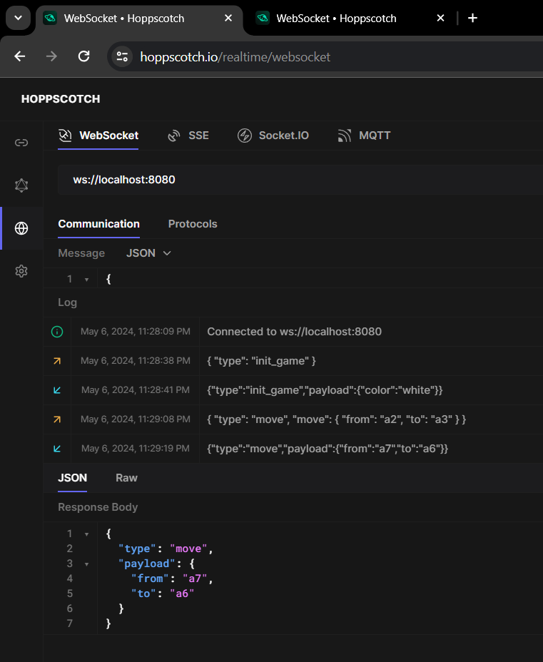
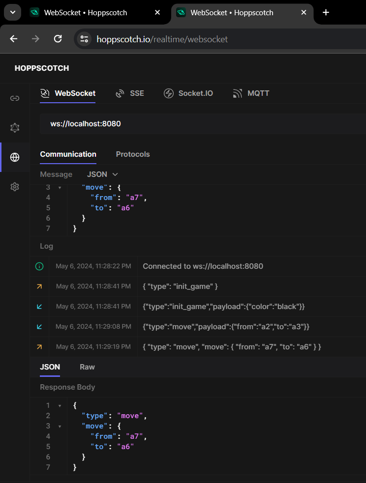

## Working Logic for a Chess Backend that sends moves across a backend

**What have we managed uptil now**

- Creating a Chess beginner level backend
- Initialises the game and assigns colors "B | W" to each user after connecting to each other
- Users can send moves across socket server as payloads
- Validation of moves happens with Chess Library itself

**Game.ts** Our Game Logic resides here

```Typescript
import { Chess } from 'chess.js';
import { WebSocket } from 'ws';
import { GAME_OVER, INIT_GAME } from './messages';

export class Game {
  public player1: WebSocket;
  public player2: WebSocket;
  public board: Chess;
  private startTime: Date;
  private moveCount = 0;

  constructor(player1: WebSocket, player2: WebSocket) {
    this.player1 = player1;
    this.player2 = player2;
    this.board = new Chess();
    this.startTime = new Date();
    this.player1.send(
      JSON.stringify({
        type: INIT_GAME,
        payload: {
          color: 'white',
        },
      })
    );
    this.player2.send(
      JSON.stringify({
        type: INIT_GAME,
        payload: {
          color: 'black',
        },
      })
    );
  }

  makeMove(socket: WebSocket, move: { from: string; to: string }) {
    // validation of moves using zod
    // Is it the users move

    if (this.moveCount % 2 === 0 && socket !== this.player1) {
      return;
    }
    if (this.moveCount % 2 === 1 && socket !== this.player2) {
      return;
    }

    try {
      this.board.move(move);
    } catch (error) {
      return;
    }

    // Check if the game is over
    if (this.board.isGameOver()) {
      // Send the game over message to both players
      this.player1.emit(
        JSON.stringify({
          type: GAME_OVER,
          payload: {
            winner: this.board.turn() === 'w' ? 'black' : 'white',
          },
        })
      );

      return;
    }

    if (this.moveCount % 2 === 0) {
      this.player2.send(
        JSON.stringify({
          type: 'move',
          payload: move,
        })
      );
    } else {
      this.player1.send(
        JSON.stringify({
          type: 'move',
          payload: move,
        })
      );
    }

    this.moveCount++;

    // Send the update board to both players
  }
}

```



